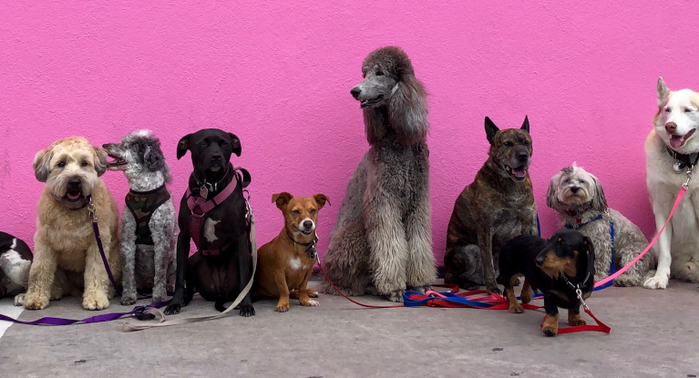

# Dog Breeds



Dataset obtained from [DogTime](https://dogtime.com/dog-breeds). There are 349 observations (breeds) and 36 features. Dataset are available in different formats:

- JSON
- CSV
- pickle (pandas dataframe)

## Dataset

### .dtypes

```
breed                                 object
url                                   object
a_adaptability                         int64
a1_adapts_well_to_apartment_living     int64
a2_good_for_novice_owners              int64
a3_sensitivity_level                   int64
a4_tolerates_being_alone               int64
a5_tolerates_cold_weather              int64
a6_tolerates_hot_weather               int64
b_all_around_friendliness              int64
b1_affectionate_with_family            int64
b2_incredibly_kid_friendly_dogs        int64
b3_dog_friendly                        int64
b4_friendly_toward_strangers           int64
c_health_grooming                      int64
c1_amount_of_shedding                  int64
c2_drooling_potential                  int64
c3_easy_to_groom                       int64
c4_general_health                      int64
c5_potential_for_weight_gain           int64
c6_size                                int64
d_trainability                         int64
d1_easy_to_train                       int64
d2_intelligence                        int64
d3_potential_for_mouthiness            int64
d4_prey_drive                          int64
d5_tendency_to_bark_or_howl            int64
d6_wanderlust_potential                int64
e_exercise_needs                       int64
e1_energy_level                        int64
e2_intensity                           int64
e3_exercise_needs                      int64
e4_potential_for_playfulness           int64
breed_group                           object
height                                object
weight                                object
life_span                             object
```

### .head()

|    | breed            | url                                             |   a_adaptability |   a1_adapts_well_to_apartment_living |   a2_good_for_novice_owners |   a3_sensitivity_level |   a4_tolerates_being_alone |   a5_tolerates_cold_weather |   a6_tolerates_hot_weather |   b_all_around_friendliness |   b1_affectionate_with_family |   b2_incredibly_kid_friendly_dogs |   b3_dog_friendly |   b4_friendly_toward_strangers |   c_health_grooming |   c1_amount_of_shedding |   c2_drooling_potential |   c3_easy_to_groom |   c4_general_health |   c5_potential_for_weight_gain |   c6_size |   d_trainability |   d1_easy_to_train |   d2_intelligence |   d3_potential_for_mouthiness |   d4_prey_drive |   d5_tendency_to_bark_or_howl |   d6_wanderlust_potential |   e_exercise_needs |   e1_energy_level |   e2_intensity |   e3_exercise_needs |   e4_potential_for_playfulness | breed_group      | height                                                     | weight          | life_span      |
|---:|:-----------------|:------------------------------------------------|-----------------:|-------------------------------------:|----------------------------:|-----------------------:|---------------------------:|----------------------------:|---------------------------:|----------------------------:|------------------------------:|----------------------------------:|------------------:|-------------------------------:|--------------------:|------------------------:|------------------------:|-------------------:|--------------------:|-------------------------------:|----------:|-----------------:|-------------------:|------------------:|------------------------------:|----------------:|------------------------------:|--------------------------:|-------------------:|------------------:|---------------:|--------------------:|-------------------------------:|:-----------------|:-----------------------------------------------------------|:----------------|:---------------|
|  0 | Afador           | https://dogtime.com/dog-breeds/afador           |                2 |                                    1 |                           1 |                      3 |                          3 |                           4 |                          2 |                           3 |                             4 |                                 2 |                 3 |                              1 |                   3 |                       4 |                       3 |                  2 |                   3 |                              4 |         4 |                4 |                  1 |                 5 |                             4 |               4 |                             4 |                         4 |                  4 |                 4 |              4 |                   4 |                              3 | Mixed Breed Dogs | 20 to 29 inches                                            | 50 to 75 pounds | 10 to 12 years |
|  1 | Affenhuahua      | https://dogtime.com/dog-breeds/affenhuahua      |                3 |                                    4 |                           4 |                      4 |                          1 |                           2 |                          3 |                           3 |                             4 |                                 3 |                 2 |                              2 |                   3 |                       2 |                       1 |                  4 |                   4 |                              5 |         1 |                3 |                  3 |                 3 |                             4 |               2 |                             4 |                         2 |                  3 |                 4 |              3 |                   3 |                              3 | Mixed Breed Dogs | 6 to 12 inches                                             | 4 to 12 pounds  | 13 to 18 years |
|  2 | Affenpinscher    | https://dogtime.com/dog-breeds/affenpinscher    |                3 |                                    5 |                           4 |                      3 |                          1 |                           3 |                          3 |                           3 |                             5 |                                 1 |                 4 |                              3 |                   2 |                       1 |                       1 |                  3 |                   4 |                              3 |         1 |                3 |                  2 |                 4 |                             4 |               3 |                             2 |                         2 |                  4 |                 4 |              3 |                   3 |                              4 | Companion Dogs   | 9 inches to 11 inches tall at the shoulder                 | 7 to 9 pounds   | 12 to 14 years |
|  3 | Afghan Hound     | https://dogtime.com/dog-breeds/afghan-hound     |                4 |                                    5 |                           3 |                      5 |                          2 |                           5 |                          5 |                           4 |                             5 |                                 5 |                 4 |                              2 |                   2 |                       4 |                       1 |                  1 |                   3 |                              1 |         4 |                3 |                  1 |                 4 |                             3 |               5 |                             2 |                         5 |                  4 |                 5 |              2 |                   4 |                              4 | Hound Dogs       | 2 feet to 2 feet, 4 inches tall at the shoulder            | 50 to 60 pounds | 10 to 12 years |
|  4 | Airedale Terrier | https://dogtime.com/dog-breeds/airedale-terrier |                2 |                                    1 |                           2 |                      3 |                          2 |                           3 |                          3 |                           4 |                             4 |                                 4 |                 4 |                              3 |                   3 |                       2 |                       1 |                  2 |                   3 |                              4 |         3 |                5 |                  4 |                 5 |                             5 |               5 |                             4 |                         4 |                  5 |                 5 |              3 |                   5 |                              5 | Terrier Dogs     | 1 foot, 9 inches to 1 foot, 11 inches tall at the shoulder | 40 to 65 pounds | 10 to 13 years |

### .tail()

|     | breed                       | url                                                        |   a_adaptability |   a1_adapts_well_to_apartment_living |   a2_good_for_novice_owners |   a3_sensitivity_level |   a4_tolerates_being_alone |   a5_tolerates_cold_weather |   a6_tolerates_hot_weather |   b_all_around_friendliness |   b1_affectionate_with_family |   b2_incredibly_kid_friendly_dogs |   b3_dog_friendly |   b4_friendly_toward_strangers |   c_health_grooming |   c1_amount_of_shedding |   c2_drooling_potential |   c3_easy_to_groom |   c4_general_health |   c5_potential_for_weight_gain |   c6_size |   d_trainability |   d1_easy_to_train |   d2_intelligence |   d3_potential_for_mouthiness |   d4_prey_drive |   d5_tendency_to_bark_or_howl |   d6_wanderlust_potential |   e_exercise_needs |   e1_energy_level |   e2_intensity |   e3_exercise_needs |   e4_potential_for_playfulness | breed_group      | height                                                     | weight          | life_span      |
|----:|:----------------------------|:-----------------------------------------------------------|-----------------:|-------------------------------------:|----------------------------:|-----------------------:|---------------------------:|----------------------------:|---------------------------:|----------------------------:|------------------------------:|----------------------------------:|------------------:|-------------------------------:|--------------------:|------------------------:|------------------------:|-------------------:|--------------------:|-------------------------------:|----------:|-----------------:|-------------------:|------------------:|------------------------------:|----------------:|------------------------------:|--------------------------:|-------------------:|------------------:|---------------:|--------------------:|-------------------------------:|:-----------------|:-----------------------------------------------------------|:----------------|:---------------|
| 344 | Whoodle                     | https://dogtime.com/dog-breeds/whoodle                     |                3 |                                    4 |                           1 |                      3 |                          1 |                           4 |                          2 |                           4 |                             4 |                                 4 |                 3 |                              4 |                   3 |                       2 |                       1 |                  3 |                   4 |                              2 |         3 |                2 |                  2 |                 4 |                             1 |               2 |                             1 |                         3 |                  4 |                 4 |              4 |                   4 |                              4 | Mixed Breed Dogs | 12 to 20 inches                                            | 20 to 45 pounds | 12 to 15 years |
| 345 | Wirehaired Pointing Griffon | https://dogtime.com/dog-breeds/wirehaired-pointing-griffon |                3 |                                    1 |                           3 |                      4 |                          1 |                           4 |                          3 |                           5 |                             5 |                                 5 |                 4 |                              5 |                   3 |                       1 |                       1 |                  3 |                   4 |                              3 |         3 |                4 |                  5 |                 5 |                             3 |               4 |                             4 |                         4 |                  4 |                 5 |              3 |                   4 |                              5 | Sporting Dogs    | 1 foot, 8 inches to 2 feet tall at the shoulder            | 50 to 60 pounds | 10 to 14 years |
| 346 | Xoloitzcuintli              | https://dogtime.com/dog-breeds/xoloitzuintli               |                3 |                                    5 |                           1 |                      5 |                          1 |                           3 |                          3 |                           3 |                             5 |                                 3 |                 2 |                              1 |                   4 |                       5 |                       1 |                  5 |                   5 |                              3 |         3 |                4 |                  3 |                 5 |                             3 |               5 |                             5 |                         5 |                  3 |                 3 |              3 |                   3 |                              3 | Companion Dogs   | 1 foot, 6 inches to 1 foot, 11 inches tall at the shoulder | 10 to 50 pounds | 14 to 20 years |
| 347 | Yorkipoo                    | https://dogtime.com/dog-breeds/yorkipoo                    |                4 |                                    5 |                           5 |                      4 |                          3 |                           2 |                          3 |                           4 |                             5 |                                 4 |                 3 |                              2 |                   2 |                       1 |                       1 |                  4 |                   3 |                              2 |         1 |                4 |                  4 |                 4 |                             3 |               3 |                             5 |                         2 |                  4 |                 5 |              3 |                   3 |                              4 | Hybrid Dogs      | 7 inches to 1 foot, 3 inches tall at the shoulder          | 3 to 14 pounds  | 10 to 15 years |
| 348 | Yorkshire Terrier           | https://dogtime.com/dog-breeds/yorkshire-terrier           |                3 |                                    5 |                           4 |                      5 |                          2 |                           2 |                          2 |                           3 |                             4 |                                 2 |                 3 |                              2 |                   2 |                       2 |                       1 |                  1 |                   4 |                              2 |         1 |                3 |                  3 |                 3 |                             2 |               2 |                             3 |                         3 |                  5 |                 5 |              4 |                   4 |                              5 | Companion Dogs   | 8 inches to 9 inches tall at the shoulder                  | 4 to 6 pounds   | 12 to 15 years |

### .describe()

|       |   a_adaptability |   a1_adapts_well_to_apartment_living |   a2_good_for_novice_owners |   a3_sensitivity_level |   a4_tolerates_being_alone |   a5_tolerates_cold_weather |   a6_tolerates_hot_weather |   b_all_around_friendliness |   b1_affectionate_with_family |   b2_incredibly_kid_friendly_dogs |   b3_dog_friendly |   b4_friendly_toward_strangers |   c_health_grooming |   c1_amount_of_shedding |   c2_drooling_potential |   c3_easy_to_groom |   c4_general_health |   c5_potential_for_weight_gain |   c6_size |   d_trainability |   d1_easy_to_train |   d2_intelligence |   d3_potential_for_mouthiness |   d4_prey_drive |   d5_tendency_to_bark_or_howl |   d6_wanderlust_potential |   e_exercise_needs |   e1_energy_level |   e2_intensity |   e3_exercise_needs |   e4_potential_for_playfulness |
|:------|-----------------:|-------------------------------------:|----------------------------:|-----------------------:|---------------------------:|----------------------------:|---------------------------:|----------------------------:|------------------------------:|----------------------------------:|------------------:|-------------------------------:|--------------------:|------------------------:|------------------------:|-------------------:|--------------------:|-------------------------------:|----------:|-----------------:|-------------------:|------------------:|------------------------------:|----------------:|------------------------------:|--------------------------:|-------------------:|------------------:|---------------:|--------------------:|-------------------------------:|
| count |        349       |                            349       |                   349       |             349        |                 349        |                   349       |                 349        |                  349        |                     349       |                         349       |         349       |                      349       |          349        |               349       |               349       |          349       |          349        |                     349        | 349       |       349        |          349       |        349        |                    349        |       349       |                     349       |                 349       |         349        |        349        |      349       |          349        |                     349        |
| mean  |          3.0659  |                              3.05731 |                     2.88252 |               3.74212  |                   2.04585  |                     3.23782 |                   2.98567  |                    4.01719  |                       4.64183 |                           4.08596 |           3.4957  |                        3.33524 |            3.03725  |                 3       |                 1.7765  |            3.3553  |            3.47851  |                       3.34957  |   2.87106 |         3.45559  |            3.48711 |          4.07736  |                      3.06304  |         3.4212  |                       3.07736 |                   3.20917 |           4.06017  |          4.09169  |        3.29799 |            3.98854  |                       4.3467   |
| std   |          0.52927 |                              1.50177 |                     1.17955 |               0.842122 |                   0.921123 |                     1.16617 |                   0.901672 |                    0.765448 |                       0.57792 |                           0.97294 |           1.10021 |                        1.11646 |            0.593344 |                 1.22709 |                 1.10974 |            1.29759 |            0.927066 |                       0.918132 |   1.14621 |         0.617191 |            1.08171 |          0.721013 |                      0.968785 |         1.15107 |                       1.14082 |                   1.20551 |           0.765147 |          0.882567 |        1.01002 |            0.958858 |                       0.756293 |
| min   |          2       |                              1       |                     1       |               2        |                   1        |                     1       |                   1        |                    1        |                       2       |                           1       |           1       |                        1       |            2        |                 1       |                 1       |            1       |            1        |                       1        |   1       |         2        |            1       |          1        |                      1        |         1       |                       1       |                   1       |           2        |          2        |        1       |            1        |                       1        |
| 25%   |          3       |                              2       |                     2       |               3        |                   1        |                     2       |                   2        |                    4        |                       4       |                           4       |           3       |                        3       |            3        |                 2       |                 1       |            2       |            3        |                       3        |   2       |         3        |            3       |          4        |                      2        |         3       |                       2       |                   2       |           4        |          4        |        3       |            3        |                       4        |
| 50%   |          3       |                              3       |                     3       |               4        |                   2        |                     3       |                   3        |                    4        |                       5       |                           4       |           4       |                        3       |            3        |                 3       |                 1       |            3       |            4        |                       3        |   3       |         3        |            4       |          4        |                      3        |         3       |                       3       |                   3       |           4        |          4        |        3       |            4        |                       4        |
| 75%   |          3       |                              4       |                     4       |               4        |                   3        |                     4       |                   4        |                    5        |                       5       |                           5       |           4       |                        4       |            3        |                 4       |                 2       |            4       |            4        |                       4        |   4       |         4        |            4       |          5        |                      4        |         4       |                       4       |                   4       |           5        |          5        |        4       |            5        |                       5        |
| max   |          4       |                              5       |                     5       |               5        |                   5        |                     5       |                   5        |                    5        |                       5       |                           5       |           5       |                        5       |            5        |                 5       |                 5       |            5       |            5        |                       5        |   5       |         5        |            5       |          5        |                      5        |         5       |                       5       |                   5       |           5        |          5        |        5       |            5        |                       5        |